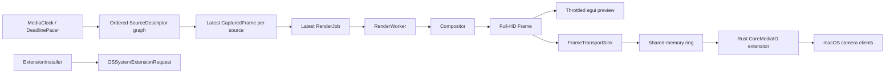

# CameraMan Architecture

CameraMan is a Rust-only macOS camera compositor. It combines an ordered graph
of generated and physical-camera sources into one BGRA output frame, previews
that frame in an egui desktop app, and publishes the latest composed frame to a
Rust CoreMediaIO system extension prototype.

## Current State

What works:

- Rust library and CLI compile.
- The egui app launches from `cargo run`.
- Synthetic sources compose into a full 1920x1080 BGRA output while the UI uploads a separately throttled 960x540 preview texture.
- Real camera discovery and background capture use `nokhwa`.
- AVFoundation `uniqueID` values provide stable `uid:` source identity; aliases migrate legacy numeric selections and transform keys when devices are rediscovered.
- Capture negotiation tries the requested output geometry/rate across every format decodable by the RGBA adapter, then bounded rate/resolution fallbacks. The physical-camera smoke selected 1920x1080 at 30 fps rather than the backend's 320x240 initial format.
- Capture workers serialize same-id ownership with a process-local lease while keeping shutdown joins off egui.
- Camera enumeration and frame capture each stay off the egui thread.
- One ordered typed source graph can mix generated sources and multiple cameras without a global input mode.
- Bounded app preferences persist through eframe storage without serializing runtime camera/worker/frame state.
- Named scenes, 1 MiB-bounded versioned import, atomic export, gesture-coalesced Undo/Redo, missing-source policy and typed source transforms share one schema/runtime model.
- Camera sources retain stable scene identity through disappearance and use bounded reconnect with a manual Retry command; backoff resets only after an actual frame.
- Explicit reorder controls define stable composition order; PiP treats the first selected source as primary.
- Composition and virtual publication run on a latest-job worker, never on the egui thread.
- An owned media-clock thread uses the shared absolute-deadline pacer and emits coalesced latest-only wakeups; egui consumes ticks but does not define stream cadence.
- Cloned frames share immutable pixel storage and detach only on mutation.
- The app publishes live composed frames through one three-slot mmap protocol: POSIX shm for bare development and an App Group container file for signed bundles.
- The extension borrows the newest mmap slot, copies directly into a bounded pooled `CVPixelBuffer`, attaches Rec.709 metadata, and emits `CMSampleBuffer` frames.
- Cross-process metadata uses a writer generation, sequence, monotonic capture time and separate diagnostic wall time. The reader resets on generation changes and classifies restart/drop/format/timing/stale discontinuities.
- Per-source integrity and health vectors preserve generation, sequence, timing, drops, jitter, reconnect, negotiated format and consumer acknowledgement as typed dimensions.
- Every app/transport worker channel has an explicit bounded slow-consumer policy; diagnostics rate-limit duplicate event-ring feedback without losing counter accuracy.
- Scene changes flow through a typed invalidation graph for preview, output, persistence and undo rather than refreshing every derived value.
- Protocol v4 exposes exact consumer generation/sequence acknowledgement for the virtual-camera self-test.
- Extension pacing is deadline-based, producer frames expire, and independent client start/stop requests pass through a tested lifecycle state machine.
- Copy/allocation costs, typed drops and bounded percentile windows are process-local diagnostics. Stable `tracing` spans are mirrored to native macOS signposts.
- File-spool transport remains available only as an explicit diagnostic fallback.
- The extension falls back to generated placeholder frames when no app frame is available.
- The app can request system-extension activation through `OSSystemExtensionRequest`.
- The CLI can build `target/CameraMan.app` and an embedded `.systemextension`.
- App/extension plist values are generated structurally from shared runtime constants.
- Virtual-camera dimensions and fps bounds/presets are shared across app, transport, config, and extension code.
- Release signing failures stop bundling with command/status/stderr context; diagnostics remain usable when bundles or profiles are missing.
- Tests cover domain contracts and migrations, deterministic reducers, dependency direction, pooled/borrowed transport behavior, concurrent no-tearing publication, perceptual quality, CLI packaging contracts, provisioning, and extension lifecycle/timing.
- Loom, Kani, Miri, structured fuzzing, child-process crash/restart and slow multi-reader tests cover the factored protocol and arithmetic boundaries.
- Release policy includes cargo-deny/RustSec, dual licensing/notices, SPDX 3.0.1, pinned Actions, minimal entitlement allowlists, temporary signing material, notarization/stapling/Gatekeeper and hosted provenance.
- `research.md` records two 100-repository/primary-literature surveys and maps their findings to recommendations 501-700.

What is still development-only:

- The default app bundle is ad-hoc signed, so it launches but cannot install a system extension.
- A real install requires separate host/extension profiles; the bundler validates bundle ids, required entitlements and Team IDs before embedding either one.
- Installable packaging requires one exact App Group shared by both profiles and signs it into both bundles.
- One full-frame app-to-mmap copy and one mmap-to-Core-Video upload remain visible in the copy ledger. IOSurface/wgpu are experiments, not the production path.
- Rec.709 attachment propagation still needs validation in a third-party consumer after a real signed install.
- The fixed eight-hour 1080p30/four-source acceptance profile passes short
  correctness/latency smoke runs; RSS qualification and the complete duration
  still need a release run on the recorded target hardware.
- The extension's CoreMediaIO/Objective-C callbacks are panic-contained and every unsafe block has an enforced invariant, but the containment defaults have only been exercised in unit tests, not against a real signed CMIO host.

## Module Map

```text
src/config.rs
  VideoFormat
  VirtualCameraConfig
  shared virtual device/stream names and UIDs
  shared output dimensions, fps range and presets

src/app_group.rs
  bundled App Group discovery
  shared container frame path

src/error.rs
  CameraManError
  CaptureErrorKind
  ErrorCode
  user and diagnostic message boundaries

src/diagnostics.rs
  stable pipeline spans and macOS signposts
  bounded latency histograms and typed drop counters
  local diagnostic event ring and redacted JSON snapshots

src/media_time.rs
  media, monotonic and wall-clock newtypes
  injectable Clock contract and writer generations

src/media_contract.rs
  colorimetry/range/alpha contract
  aperture, aspect ratio, orientation and mirror metadata

src/format_negotiation.rs
  typed dimensions/pixel/fps/color/latency/ownership negotiation
  atomic format epoch coordinator

src/frame_integrity.rs
  per-source generation, sequence and timestamp history
  discontinuity and typed drop classification

src/source_health.rs
  freshness/drop/jitter/reconnect/format/consumer-ack vector
  compact non-color UI summary without erasing diagnostics

src/backpressure.rs
  explicit policy and capacity for render, mmap, discovery and capture channels

src/invalidation.rs
  typed SceneChange -> preview/output/persistence/undo dependencies

src/parser_limits.rs
  shared byte/depth/element/string/allocation budgets
  bounded file reads and pre-deserialization JSON-depth validation

src/scene_schema.rs
  versioned scene DTO, missing-source policy and sequential migrations

src/source_transform.rs
  typed crop, scaling, rotation, mirror, opacity and position

src/wire.rs
  versioned transport-only pixel/timing descriptors

src/frame.rs
  PixelFormat
  Frame
  FrameLimits
  FrameView
  FrameMetadata
  CapturedFrame

src/layout.rs
  CompositionLayout (Row/Column/Grid/PictureInPicture)
  GridLayout
  GridLayoutCalculator
  Cell

src/render.rs
  Compositor
  ScalingFilter (Nearest/Bilinear)
  transformed composition with identity fast paths

src/camera.rs
  CameraDevice
  CameraDiscovery
  FrameSource
  SyntheticFrameSource

src/capture.rs
  NokhwaCameraDiscovery
  private nokhwa frame adapter
  ThreadedNokhwaFrameSource
  bounded open/first-frame watchdog over the process-local camera lease
  capture_one_with_timeout (one-shot over the same leased worker)

src/virtual_camera.rs
  VirtualCameraSink
  MemorySink

src/frame_transport.rs
  FrameSpoolSink
  TransportFrame
  read_latest_frame
  default_frame_spool_path

src/shared_memory_transport.rs + src/shared_memory_transport/
  SharedFrameSink
  SharedFrameReader
  v4 protocol layout, slot state machine, mapped backend, writer and borrowed reader
  producer/consumer progress acknowledgement

src/transport.rs
  FrameTransportMode
  FrameTransportSink
  FrameTransportReader
  environment-selected RAM/file adapter

src/pipeline.rs
  PipelineEngine (synchronous SDK/example harness, not the app runtime)
  PipelineMetrics
  RenderReport
  RunSummary

src/ppm.rs
  write_ppm
  write_ppm_with_metadata
  PpmMetadata
  PpmSequenceSink

src/system_extension.rs
  EXTENSION_BUNDLE_ID
  ExtensionInstaller
  ExtensionActivationStatus
  OSSystemExtensionRequest delegate bridge

src/provisioning.rs
  provisioning-profile CMS decode
  structured plist validation
  app-id and entitlement checks

src/render_worker.rs
  RenderJob
  RenderWorker
  one replaceable pending job
  background composition and virtual publication

src/media_clock.rs
  autonomous absolute-deadline app cadence
  latest-only tick coalescing and explicit start/stop

src/source_descriptor.rs
  SourceKind and validated SourceDescriptor identity
  stable per-source keys for scenes and transforms

src/camera_discovery_worker.rs
  one in-flight enumeration request
  nonblocking result polling from egui

src/app_preferences.rs
  bounded serializable user preferences
  eframe storage load/save boundary

src/app.rs + src/app/
  composition root and persisted state
  deterministic AppCommand/AppEvent reducer
  scene persistence, capture coordination and extension readiness
  localized primary scene, preview, output and setup controls
  stable English machine-oriented diagnostic payloads

src/extension_main.rs + src/extension/
  minimal platform entry point
  provider/device/stream Objective-C objects
  frame pump, deadline timing and pixel-buffer pool adapter

src/main.rs + src/main/
  argument routing and app launch
  CLI commands, bundle assembly, signing and diagnostics
  typed app/extension plist builders

benches/compositor.rs
  720p/1080p, 1/2/4/8-source Grid/PiP nearest/bilinear matrix
  schema 3 ARM64/x86_64 raw JSON, shared fixtures, copy ledger and environment

src/benchmarking.rs
  shared patterned fixture and duration statistics
  environment snapshots, seeded order, report DTOs and process bootstrap

src/performance.rs
  copy/allocation ledger
  reusable resident/peak/allocator, wakeup, pagein and macOS raw-energy snapshots

src/bin/cameraman-benchmark-series.rs
  strict AC preflight and independent randomized process orchestration
  raw reports, bootstrap summary and hashed reproducibility manifest

src/bin/cameraman-benchmark-summary.rs
  schema 2/3 reader and process-level bootstrap comparison

src/bin/cameraman-e2e-benchmark.rs
  representative compose -> mmap -> separate-process borrowed-input profile
  distinct service, queue, throughput and acknowledgement latency metrics

src/bin/cameraman-diagnostics.rs
  privacy-redacted versioned JSON export

src/bin/cameraman-soak.rs
  default eight-hour compose/mmap/borrow profile
  schema 4 RSS, footprint, allocator, wakeup, pagein, energy and correctness report

src/bin/cameraman-transport-benchmark.rs
  identical copy/borrow workload over mmap slots and a mutex reference

tools/resize-bench/
  capture/UI-independent ARM64/x86_64 scaler comparison

fuzz/fuzz_targets/frame_new_checked.rs
  arbitrary dimension/buffer validation input

tests/golden/compositor-row.ppm
tests/golden/ppm-writer.ppm
  tiny visual composition contract

examples/custom_source.rs
examples/custom_sink.rs
  executable trait implementations

tests/cli_smoke.rs
  compiled-binary status/check/help verification

.github/workflows/ci.yml
  macOS strict checks, ARM64/x86_64 feature powersets, merged LLVM coverage

.github/workflows/release.yml
  public API semver, production signing, notarization and provenance

.github/workflows/maintenance.yml
  pinned-nightly unused-dependency audit

scripts/acceptance-1080p30.sh + benchmarks/acceptance/
  fixed-hardware 1080p30/four-source release qualification

research.md
  200 repository metadata/README review in two dated sets
  deeper inspection of 40 representative repositories
  scientific, standards, and official platform sources
  evidence-to-backlog synthesis
```

### Implemented Module Split

The hardening pass applied Parnas-style information hiding to the four largest
entry modules while preserving their public facades:

```text
src/app.rs             composition root, state and eframe lifecycle
src/app/
  controller.rs        AppCommand -> AppEvent transitions
  capture_coordination.rs source ownership and failure policy
  extension_readiness.rs activation preflight and report
  scenes.rs            named scene, bounded import, atomic export and gesture history
  localization.rs      bounded RU/EN application vocabulary
  ui.rs                three-column shell, source list and status bar
  ui_scene.rs          scene selection and source transform inspector
  ui_output.rs         output contract and primary controls
  ui_setup.rs          activation, self-test and diagnostics setup window

src/main.rs            argument routing and shared composition root
src/main/
  cli.rs              user commands and demos
  bundle.rs           bundle assembly orchestration
  signing.rs          codesign/profile contracts
  diagnostics.rs      human and JSON reports
  typed_plist.rs      typed plist builders

src/extension_main.rs  platform gate and entry point
src/extension/
  objects.rs          provider/device/stream objects
  frame_pump.rs       newest-frame/stale/discontinuity policy
  pixel_buffer.rs     pool, color attachments, frame copy
  timing.rs           host-clock conversion and advertised cadence

src/shared_memory_transport.rs public facade
src/shared_memory_transport/
  protocol.rs         versioned header/slot state machine
  mapped_backend.rs   POSIX/App Group mmap and platform helpers
  writer.rs           publication and generation ownership
  reader.rs           borrowed read lease
```

Dependencies continue to point inward: UI, CLI, CMIO, and mmap adapters may
depend on frame/render contracts; frame/render code must not import those
adapters. Splitting happens when each move leaves tests passing and reduces a
real change boundary.

## Data Flow



Mixed-source preview:

```text
ordered SourceDescriptor values
  -> SyntheticFrameSource and ThreadedNokhwaFrameSource together
  -> latest CapturedFrame or None per source, preserving scene order
  -> latest RenderJob
  -> RenderWorker / Compositor
  -> full 1920x1080 Frame
  -> FrameTransportSink when live output is enabled
  -> downscaled egui texture result
```

Camera capture branch:

```text
NokhwaCameraDiscovery
  -> selected camera descriptors from the shared source graph
  -> ThreadedNokhwaFrameSource per selected id
  -> latest CapturedFrame or None per source
  -> latest RenderJob (older pending job is replaced)
  -> RenderWorker / Compositor
  -> full FrameTransportSink output
  -> throttled egui texture result
```

Virtual camera backend:

```text
CameraManApp
  -> RenderWorker
  -> FrameTransportSink
  -> SharedFrameSink (default)
  -> /cameraman-frame-v4-<uid>, three mmap slots, PID/start token + consumer ack
  -> cameraman-extension
  -> FrameTransportReader
  -> SharedFrameReader
  -> CVPixelBuffer
  -> CMSampleBuffer
  -> CMIOExtensionStream::sendSampleBuffer
```

Diagnostic fallback replaces `SharedFrameSink`/`SharedFrameReader` with
`FrameSpoolSink`/`read_latest_frame` only when
`CAMERAMAN_FRAME_TRANSPORT=file` is set.

The measured hot-path review and the proposed zero-copy Rust-only rebuild are
kept in [`docs/performance-review.md`](docs/performance-review.md). The current
design deliberately retains a deterministic CPU compositor; a future Metal
path is accepted only when an IOSurface-backed end-to-end prototype removes
readback and wins on real signed capture-to-consumer measurements.

System-extension activation:

```text
CameraMan.app from /Applications
  -> ExtensionInstaller::activate()
  -> OSSystemExtensionRequest
  -> OSSystemExtensionRequestDelegate callbacks
  -> ExtensionActivationStatus
  -> app status label
```

## SOLID Split

Single Responsibility:

- `Frame` validates pixels and shares immutable bytes through copy-on-write storage.
- `FrameLimits` owns single-frame memory policy independently of pixel layout.
- `FrameView` validates borrowed padded rows and performs no implicit copy.
- `FrameMetadata` describes source, sequence, and timestamp.
- `GridLayoutCalculator` calculates cells.
- `Compositor` copies/scales pixels into the output frame.
- `FrameSource` reads one source.
- `VirtualCameraSink` receives one composed output.
- `FrameTransportSink` selects a transport without leaking that choice into the app.
- `SharedFrameSink` only publishes the newest frame into process-shared RAM.
- `FrameSpoolSink` only implements the explicit file fallback.
- `ExtensionInstaller` only requests system-extension activation.
- `PipelineEngine` orchestrates source -> render -> sink only for the synchronous SDK example and core tests.
- `PipelineMetrics` records source/render/sink costs and dropped inputs without knowing platform APIs.
- `MediaClock` owns production cadence; `RenderWorker` owns app composition, latest-only backpressure, and virtual publication away from the UI thread.
- `CameraDiscoveryWorker` owns one asynchronous enumeration request.
- `AppPreferences` owns only bounded serializable user choices.

Open/Closed:

- Add camera backends by implementing `CameraRuntime`, which extends
  `FrameSource` with the negotiated format, frame rate, stall age and
  frame-gap state the app reads. `CameraManApp` stores these as
  `Box<dyn CameraRuntime>` and reads only trait methods off them, so a second
  backend's frames, health and negotiated format need no application change.
  `tests/camera_backend_seam.rs` writes such a backend from outside the crate,
  so that half is a compile error when it breaks rather than a claim.
- The read side is open; enumeration and construction are not, and the
  difference is worth counting. A non-nokhwa backend also needs
  `CameraDiscoveryWorker::start` taught where its devices come from
  (`camera_discovery_worker.rs:32` calls `NokhwaCameraDiscovery` directly),
  the two construction sites in `app/capture_coordination.rs`, the import in
  `app.rs` those submodules share, and the one-shot `capture_one_with_timeout`
  path `main/cli.rs` uses. Five files, so "one new `impl`" describes the read
  side only. `CameraDiscovery` is published but has no `dyn` user in the crate.
- `FrameSource` alone is the SDK seam: `PipelineEngine` accepts
  `Vec<Box<dyn FrameSource>>`, as `examples/custom_source.rs` shows. It is not
  how the app gains an input — a non-camera app cell is the built-in
  `SyntheticFrameSource` that `app/capture_coordination.rs:20` constructs per
  tick, so a file or recorded input is a new source kind in the app, not a new
  `impl` of `FrameSource`.
- Add sinks by implementing `VirtualCameraSink`.
- Add layouts in `layout.rs`; capture and the compositor stay untouched. The
  exhaustive `match` makes the rest loud rather than silent: a new variant also
  needs its label and picker entry in `app/ui_output.rs`.
- Add UI views on top of the library types without reaching into FFI.
- `Compositor` is a concrete type, not a seam: a second composition backend
  needs a deliberate interface decision, not just a new `impl`.

Liskov Substitution:

- Synthetic and real camera sources must both behave as `FrameSource`.
- Memory, PPM, shared-memory, and file sinks must all behave as `VirtualCameraSink`.
- Test doubles should be able to replace real sources and sinks.

Interface Segregation:

- Capture does not depend on rendering.
- Rendering does not depend on CoreMediaIO.
- The UI does not call the compositor or frame transport synchronously.
- The UI polls discovery/render workers instead of calling blocking adapters.
- Bundling does not depend on app UI internals.
- Extension activation does not depend on frame transport.

Dependency Inversion:

- High-level pipeline code depends on traits: `PipelineEngine` is generic over
  `FrameSource` and `VirtualCameraSink`, and the app's camera slots are
  `Box<dyn CameraRuntime>` rather than a concrete capture type.
- Platform APIs stay in adapters.
- Tests use pure Rust doubles.
- The app composes library pieces rather than becoming the core.

## DRY Rules

Keep one source of truth for:

- output dimensions and fps: `VideoFormat`;
- virtual device/stream names and UIDs: constants in `config.rs`, consumed by
  `VirtualCameraConfig` and the CoreMediaIO extension;
- pixel memory layout: `PixelFormat`;
- frame validation: `Frame::new_checked`;
- default memory policy: `FrameLimits` and `CAMERAMAN_MAX_FRAME_BYTES`;
- machine-readable failure routing, and the user and recovery text that goes
  with each code: one `ErrorCode::profile` row per code, one
  `CaptureErrorKind::profile` row per kind;
- pipeline phase metrics: `PipelineMetrics`;
- layout cell math: `GridLayoutCalculator`;
- nearest-neighbor sampling coordinates, including the bound that keeps the
  result inside the source: `render::nearest_source_coordinate`, used by both
  the compositor and the CoreVideo upload path;
- transport mode selection: `transport.rs`;
- shared-memory layout and slot state machine: `shared_memory_transport.rs`;
- fallback file header format: `frame_transport.rs`;
- app bundle id and install entitlement: `APP_BUNDLE_ID` and
  `SYSTEM_EXTENSION_INSTALL_ENTITLEMENT`, reused by generated plist content;
- extension bundle id: `system_extension::EXTENSION_BUNDLE_ID`, reused by `main.rs`
  for the extension's `Info.plist` and `.systemextension` bundle path.
- app/extension plist shape: typed builders in `main.rs`, serialized only by
  the `plist` crate.
- persisted app settings: `AppPreferences` and its versioned storage key.
- panic behaviour at platform callbacks: `panic_boundary::contain_panic` and the
  policy in `docs/unsafe-invariants.md`.

Avoid duplicating:

- signing identities and bundle ids across docs and code;
- transport selection or parsing in app and extension;
- camera open/close logic outside `ThreadedNokhwaFrameSource`;
- CoreMediaIO unsafe code outside `src/extension_main.rs` and `src/extension/`;
- UI state labels that repeat CLI status text.

## Learning Path

Read the project in small pieces:

1. `src/frame.rs`
2. `src/layout.rs`
3. `src/render.rs`
4. `src/camera.rs`
5. `src/virtual_camera.rs`
6. `src/frame_transport.rs`
7. `src/shared_memory_transport.rs`, then `src/shared_memory_transport/`
8. `src/transport.rs`
9. `src/pipeline.rs`
10. `src/capture.rs`
11. `src/system_extension.rs`
12. `src/provisioning.rs`
13. `src/camera_discovery_worker.rs`
14. `src/render_worker.rs`
15. `src/app_preferences.rs`
16. `src/app.rs`, then the focused reducers/coordinators/views in `src/app/`
17. `src/extension_main.rs`, then provider/pump/pool modules in `src/extension/`
18. `src/main.rs`, then CLI/bundle/plist modules in `src/main/`

This order starts with pure data and ends with platform integration.

## Design Direction

CameraMan should feel like a focused desktop utility:

- compact left control panel;
- 16:9 preview as the main surface;
- status bar for live state, fps, source count, rendered frames, virtual frames, and layout;
- checkboxes for source selection;
- compact source groups plus segmented choices for layout and fps;
- segmented scaling choice keeps fast and smooth modes explicit;
- clear disabled states;
- no landing page, hero, decorative gradients, or marketing copy;
- errors should tell the user whether the problem is camera access, signing, system approval, or runtime capture.

Current design issues:

- Source order uses explicit accessible controls but has no drag gesture.
- Rendered cells have no optional source-name overlays.
- A camera backend call already blocked inside `open()` cannot be cancelled by
  nokhwa; reconnect remains bounded between attempts, not inside that call.
- Production packaging validates the App Group IPC contract; paid-profile install evidence remains an external release gate.

Fixed in this pass:

- The install-extension button used to stay clickable even when activation
  was guaranteed to fail. It now checks exact `/Applications` placement,
  nested signatures, both profiles, Team IDs, App Group entitlements, the Mach
  service prefix, and the required usage description.
- The button and its status used to sit directly under the "Output" controls
  with no visual separation; it now has its own "System Extension" label and
  separator, matching how "Output" is grouped.
- The control column had no scroll area: once the fps and system-extension
  controls were added, the bottom of the column (the Output section, the
  Install extension button) was clipped with no way to reach it, even at the
  default window size, not just near `with_min_inner_size`. It now wraps in
  `egui::ScrollArea::vertical()`.
- `Requesting` looked identical to idle and allowed another activation click.
  It now uses an accent status with a spinner, while the state-aware button
  rejects duplicate requests until activation finishes.
- Fixed fps could silently exceed a negotiated camera rate. The controls now
  show a warning when the target is above the slowest selected camera.
- Mode changes clear the existing texture immediately; source/layout changes
  advance a render epoch, so an in-flight frame from the previous state cannot
  overwrite the current preview.
- Full-size composition and RAM publication moved to `RenderWorker`; egui only
  submits the newest job and consumes completed results.
- The display path now converts at most 960x540 at 30 fps while retaining the
  full 1920x1080 frame for export and the virtual camera.
- The fixed manual control column is now a native resizable egui panel with a
  260–420 px range and a vertical scroll area. Framebuffer screenshots verify
  the default 1120x720 and minimum 920x560 layouts without overlap.
- `AppPreferences` stores ordered typed source descriptors, layout, scaling, fps,
  editable export path and virtual-output preference. Runtime camera handles,
  workers, textures and frames remain transient.
- Camera discovery moved to `CameraDiscoveryWorker`; refresh shows a spinner
  and never blocks egui.
- Sticky errors no longer compete with transient confirmations, and long
  status text truncates before the right-aligned metrics.
- Real source rows show health and composition order; capture errors include
  the source name.
- The transport endpoint has an explicit copy action and signing status links
  to the matching troubleshooting section.
- Up/down controls persist primary order for synthetic and real sources; PiP
  renders the first source full-frame and stacks later sources on top.
- Provisioning and code-signature Team IDs are extracted independently,
  compared before embedding, printed by CLI diagnostics and included in the
  in-app copy report.

## Three Iterations

### Iteration 1: Rust Core

Done:

- Rust-only crate structure.
- Validated BGRA frame model.
- Frame metadata.
- Layout calculation.
- Pure Rust compositor.
- Pipeline orchestration.
- PPM debug output.
- Unit tests for core behavior.

Reviewed and fixed:

- Zero-width/height layout edge cases.
- Overflow-prone frame size math.
- Overflow-prone source sampling math.
- Unbuffered PPM writes.
- Per-source pipeline failure now degrades to an empty cell instead of killing the whole tick.

### Iteration 2: Real Input and App

Done:

- Background camera discovery through `nokhwa`.
- Background capture thread.
- Multi-camera real selection.
- App preview with source toggles, layout controls, fps mode, status bar, and PPM export.
- Persisted bounded user preferences and editable export destination.
- Resizable/scrollable controls with source order and health indicators.
- Explicit source reorder and first-source-primary picture-in-picture layout.
- Latest-only render worker keeps composition and virtual publication off the UI thread.
- Preview texture upload is capped independently at 960x540 and 30 fps.
- Real camera resources are released on stop/uncheck.

Reviewed and fixed:

- Capture error classification is typed.
- Capture thread panics are isolated.
- Capture thread cleanup has a nonblocking join path.
- The ordered source graph supports multiple cameras and generated sources together.
- Auto fps can follow negotiated camera rates.
- Successful AVFoundation reads no longer pay an unconditional extra 10 ms
  sleep; only failures use a short retry backoff.
- Frame clones are copy-on-write and `compose_captured` borrows source frames.
- Refreshing cameras no longer blocks egui; only one discovery job can run.
- Waiting for a real frame dims the previous preview with an explicit overlay.
- Permission errors name the exact System Settings pane and per-source failures
  include the camera name.
- The compositor mutates output slices in batches and caches horizontal sample
  offsets instead of checking COW state and dividing for every output pixel.
- A permanently broken camera in a multi-camera composite used to re-post its
  error every tick. Per-source health now reports a bounded reconnect state,
  preserves scene identity, applies the selected missing-source policy and
  exposes manual Retry without flooding the status bar.
- If every selected real camera disappears, the output now follows the scene's
  explicit missing-source policy instead of silently claiming a healthy live
  preview or deleting the source from the scene.
- Reopening a device no longer resets reconnect backoff by itself. Only receipt
  of a real frame marks recovery, so a repeatedly openable but broken stream
  advances through the same bounded exponential policy.
- Pointer-driven transform edits now retain one baseline for the whole gesture;
  releasing the pointer creates one Undo step instead of up to 64 frame-level
  snapshots.
- Scene import reads at most 1 MiB even if a file grows during validation, and
  export writes, syncs and atomically renames a same-directory temporary file.
- A camera whose backend `open()` never returned used to publish no error, no
  negotiated format and no frame, so the app read `Ok(None)` forever and the
  per-source streak was reset rather than advanced. The worker now publishes its
  pre-streaming phase (lease wait, open, first read); the reader bounds that
  phase with a deadline (`CAMERAMAN_CAMERA_OPEN_TIMEOUT_MS`, default 20 s, an
  estimate rather than a measured figure, covering the whole format negotiation
  and not one device open) and reports a capture timeout, so the source turns
  RETRY, states that the camera is not responding on the status line, the
  preview overlay and the preview's accessible name alike, and offers manual
  reconnect. Retrying such a camera inherits the stall of the worker that still
  holds its lease, so the replacement does not spend a second deadline looking
  like a fresh warm-up. The one-shot `capture_one_with_timeout` behind
  `capture-demo` runs on the same worker, so it takes the camera lease, is
  bounded by the same deadline, and its timeout stops that worker instead of
  leaving an unleased open in flight. `capture-demo` gives its own budget one
  second of headroom over that deadline so the watchdog's phase-specific message
  wins over a generic "no frame" report.
- A read that hung after frames had already arrived was invisible: the pre-frame
  watchdog stops at `Streaming`, and the reader kept handing out the same
  `CapturedFrame`, so the preview froze while the source row still read OK. The
  reader now bounds the gap between published frames, with a deadline of 60
  negotiated frame intervals floored at the composite's own 2 s staleness limit,
  so a slow camera is judged on its own rate instead of a flat constant and the
  capture watchdog can never name a camera unresponsive while its picture is
  still being composited. The gap is timed on the worker's phase clock, which
  `publish_phase` rewrites for every published frame, and deliberately not on the
  frame's own capture timestamp: `FrameMetadata::age` measures on
  `CLOCK_MONOTONIC`, which on Darwin keeps advancing while the machine sleeps,
  while `Instant` (`CLOCK_UPTIME_RAW`) does not. Measured on this hardware the
  two are ~42 h apart, so a frame timestamped before a lid-close would come back
  from wake looking hours old and every sleep/wake would be reported as a wedged
  camera. The phase clock spans the same interval and counts only the time the
  camera was awake to deliver. Past the deadline `latest_frame` reports a capture
  timeout, so the source turns RETRY with `freshness=Stale` (and
  `reconnect=Connected`, because a worker parked in a backend read is reopening
  nothing), the status line, overlay and accessible name say the camera is not
  responding, and manual Retry stays available. The claim is gated on the state
  it asserts: a worker with a published error or a cleared `negotiated_format`
  has already named its failure or has left the read for reconnect backoff, and
  that window stays `retrying`. The two watchdogs partition on
  `WorkerPhase::Streaming`, so exactly one of them can speak for any worker.
  Frames resuming clear the state on the next poll through the existing recovery
  path, with no reopen. Retry now inherits a mid-stream stall the same way it
  already inherited a hung open's, because either kind of parked worker keeps the
  camera lease.

Still open:

- The abandoned open cannot be reclaimed. nokhwa exposes no cancellation hook,
  so the timed-out worker thread stays parked inside the backend and keeps its
  camera lease; that id cannot be reopened until the driver returns. The
  watchdog reports, it does not cancel. A future backend adapter must provide a
  genuinely cancelable open operation.
- A stalled read cannot be cancelled any more than a stalled open can, for the
  same missing nokhwa hook. Recovery needs the driver to return; until it does,
  the worker keeps the camera lease and Retry can only queue a replacement behind
  it.
- After Retry, the replacement's lease wait is still budgeted by
  `camera_open_timeout` (20 s) while the stall it inherits is only past the
  frame-gap deadline, so it can read as "Waiting for camera" for the remainder of
  that budget before naming the camera again. Better than restarting from zero,
  still not exact; giving the replacement the deadline its predecessor actually
  blew would close it.
- A driver that keeps returning fresh timestamps with unchanged pixels is not
  detectable by any timestamp: both the sequence and the capture time advance.
  That case remains uncovered.
- The composite still ages frames on `CLOCK_MONOTONIC`
  (`prepare_sources`/`SOURCE_STALE_AFTER`), so after a system sleep the first
  poll counts the pre-sleep frame as missing until a new one lands. That is a
  `missing N` count and a brief freeze-briefly fallback, not an error, and it
  clears on the next frame; the capture watchdog no longer joins it.
- The lease reserves a camera id string, not a physical device. Two locators for
  the same camera (`0` and `uid:<unique>`) take two different leases, and only
  the app's own retry path resolves them against each other
  (`camera_locators_match`); `capture_one_with_timeout` does not. The raw nokhwa
  adapter is private, so every public capture path still goes through the lease
  and watchdog.

### Iteration 3: Virtual Output and Packaging

Done:

- Three-slot shared-memory sink/reader from app to extension.
- Atomic slot ownership prevents torn concurrent reads and writes.
- Writer PID ownership prevents two publishers and recovers after a crashed writer.
- File-spool transport remains an explicit environment-selected fallback.
- Rust CoreMediaIO provider/device/stream prototype.
- Placeholder fallback inside extension.
- System-extension activation request UI.
- `.app` and `.systemextension` bundling.
- Ad-hoc development signing for launchable local bundles.
- Typed plist generation and version propagation.
- Strict release signing with actionable command diagnostics.
- CLI version, bundle help and extension diagnostics.

Reviewed and fixed:

- Extension service uses a run loop instead of a sleep loop.
- Format description is cached instead of recreated per frame.
- Extension creation errors are logged instead of panicking immediately.
- Release bundle now builds the extension in release mode too.
- `stop_streaming` used to only flip a bool; `start_streaming` could then race
  ahead and spawn a second `stream_samples` thread before the first one
  noticed and exited, leaving two threads sending samples to the same
  `CMIOExtensionStream` concurrently. `start_streaming` now joins the previous
  worker thread before spawning a replacement.
- The extension bundle id was duplicated across `main.rs`'s `Info.plist`
  template and the `.systemextension` bundle path; both now derive from
  `system_extension::EXTENSION_BUNDLE_ID`.
- Full-size 1920x1080 frames now copy into `CVPixelBuffer` one row at a time;
  the per-pixel scaler only runs when dimensions actually differ.
- App and extension identities, Mach service name and embedded bundle path are
  regression-tested from their shared constants.
- `diagnose-extension` reports profile, expected/actual entitlements and
  `systemextensionsctl list` even when the bundle is incomplete.
- Team IDs from app/extension signatures and the app profile are reported;
  certificate/profile mismatch stops installable bundling early.
- Client connect and stream-start callbacks now consult one pure
  signing-identity policy: identified clients are allowed, clients with no
  establishable signing identity are denied, and every decision is logged
  with signing id and pid.
- Every Objective-C callback body used to be able to unwind into the framework
  that called it, the CoreMediaIO callbacks and the SystemExtensions activation
  delegate alike: objc2 defines them as `extern "C-unwind"`, so nothing aborted
  at the boundary. Each body now runs inside `contain_panic`, which logs the
  callback name and returns a conservative default. The fallback runs contained
  too and aborts rather than resuming the unwind, since no return value can be
  fabricated for the platform. Start and stop additionally repair the lifecycle
  so a contained panic cannot strand the stream in `Starting` or `Stopping`,
  where start spawned nothing and stop refused outright.

Still open:

- Real install needs provisioning profile with system-extension entitlement.
- A real paid-profile install and client smoke test still have to exercise the
  generated App Group/Mach-service contract on macOS.
- The reader now borrows the mapped slot directly into the pooled
  `CVPixelBuffer`; one mmap publish copy and one Core Video upload remain, and
  IOSurface is accepted only if measurement removes one without regressions.
- Panic containment defaults (denied client, empty format list, empty
  properties) are unit-tested but have not been observed in a real consumer
  after a signed install.

## Learning Slices: Design, Quality, and Release

Read the current system in these small dependency-directed slices. Each slice
has one reason to change and points inward; UI and platform adapters do not own
domain rules.

1. `frame.rs`, `media_contract.rs`, `media_time.rs`: pixel ownership and the
   versioned interpretation of a frame.
2. `render.rs`, `source_transform.rs`, `quality.rs`: deterministic composition,
   transforms, exact or perceptual comparison; no UI or CMIO types.
3. `scene_schema.rs`, `invalidation.rs`, `app/scene_commands.rs`: persisted
   intent, typed edits and the derived work invalidated by each edit.
4. `app_preferences.rs`, `atomic_file.rs`, `parser_limits.rs`: bounded parse,
   migration, validation and atomic durable replacement.
5. `camera_discovery_worker.rs`, `render_worker.rs`, `app/io_worker.rs`: bounded
   jobs/results, cancellation epochs and late-result rejection around blocking
   adapters.
6. `app/accessibility.rs`, `app/ui_contracts.rs`, `app/ui_tokens.rs`: stable
   semantics, geometry and visual tokens consumed by the egui facade.
7. `shared_memory_transport/`, `frame_transport.rs`, `transport.rs`: one
   canonical frame contract over production mmap and diagnostic spool paths.
8. `extension/`: CMIO lifecycle, pacing, borrowed-slot consumption, pooled
   CoreVideo upload and Rec.709 output attachments.
9. `metal_interop.rs`, `gpu_experiment.rs`, feature-gated quality backends:
   experiments that must preserve the CPU oracle and cannot become default by
   compilation alone.
10. `scripts/build-reproducible-release.sh`, `scripts/audit-release-artifacts.sh`,
    `cameraman-release-manifest`: delivery evidence built around the two Rust
    binaries rather than mixed into runtime code.

The dependency direction is therefore domain -> application policy -> workers
and platform adapters -> UI/packaging composition roots. Repeated values live
in typed contracts, while experiment and release mechanisms remain replaceable
at explicit boundaries.
