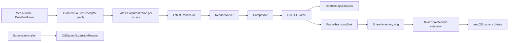

# CameraMan Architecture

CameraMan is a Rust-only macOS camera compositor. It combines an ordered graph
of generated and physical-camera sources into one BGRA output frame, previews
that frame in an egui desktop app, and publishes the latest composed frame to a
Rust CoreMediaIO system extension prototype.

## Current State

What works:

- Rust library and CLI compile.
- The egui app launches from `cargo run`.
- Synthetic sources compose into a full 1920x1080 BGRA output while the UI uploads a separately throttled 960x540 preview texture.
- Real camera discovery and background capture use `nokhwa`.
- AVFoundation `uniqueID` values provide stable `uid:` source identity; aliases migrate legacy numeric selections and transform keys when devices are rediscovered.
- Capture negotiation tries the requested output geometry/rate across every format decodable by the RGBA adapter, then bounded rate/resolution fallbacks. The physical-camera smoke selected 1920x1080 at 30 fps rather than the backend's 320x240 initial format.
- Capture workers serialize same-id ownership with a process-local lease while keeping shutdown joins off egui.
- Camera enumeration and frame capture each stay off the egui thread.
- One ordered typed source graph can mix generated sources and multiple cameras without a global input mode.
- Bounded app preferences persist through eframe storage without serializing runtime camera/worker/frame state.
- Named scenes, 1 MiB-bounded versioned import, atomic export, gesture-coalesced Undo/Redo, missing-source policy and typed source transforms share one schema/runtime model.
- Camera sources retain stable scene identity through disappearance and use bounded reconnect with a manual Retry command; backoff resets only after an actual frame.
- Explicit reorder controls define stable composition order; PiP treats the first selected source as primary.
- Composition and virtual publication run on a latest-job worker, never on the egui thread.
- An owned media-clock thread uses the shared absolute-deadline pacer and emits coalesced latest-only wakeups; egui consumes ticks but does not define stream cadence.
- Cloned frames share immutable pixel storage and detach only on mutation.
- The app publishes live composed frames through one three-slot mmap protocol: POSIX shm for bare development and an App Group container file for signed bundles.
- The extension borrows the newest mmap slot, copies directly into a bounded pooled `CVPixelBuffer`, attaches Rec.709 metadata, and emits `CMSampleBuffer` frames.
- Cross-process metadata uses a writer generation, sequence, monotonic capture time and separate diagnostic wall time. The reader resets on generation changes and classifies restart/drop/format/timing/stale discontinuities.
- Per-source integrity and health vectors preserve generation, sequence, timing, drops, jitter, reconnect, negotiated format and consumer acknowledgement as typed dimensions.
- Every app/transport worker channel has an explicit bounded slow-consumer policy; diagnostics rate-limit duplicate event-ring feedback without losing counter accuracy.
- Scene changes flow through a typed invalidation graph for preview, output, persistence and undo rather than refreshing every derived value.
- Protocol v4 exposes exact consumer generation/sequence acknowledgement for the virtual-camera self-test.
- Extension pacing is deadline-based, producer frames expire, and independent client start/stop requests pass through a tested lifecycle state machine.
- Copy/allocation costs, typed drops and bounded percentile windows are process-local diagnostics. Stable `tracing` spans are mirrored to native macOS signposts.
- File-spool transport remains available only as an explicit diagnostic fallback.
- The extension falls back to generated placeholder frames when no app frame is available.
- The app can request system-extension activation through `OSSystemExtensionRequest`.
- The CLI can build `target/CameraMan.app` and an embedded `.systemextension`.
- App/extension plist values are generated structurally from shared runtime constants.
- Virtual-camera dimensions and fps bounds/presets are shared across app, transport, config, and extension code.
- Release signing failures stop bundling with command/status/stderr context; diagnostics remain usable when bundles or profiles are missing.
- Tests cover domain contracts and migrations, deterministic reducers, dependency direction, pooled/borrowed transport behavior, concurrent no-tearing publication, perceptual quality, CLI packaging contracts, provisioning, and extension lifecycle/timing.
- Loom, Kani, Miri, structured fuzzing, child-process crash/restart and slow multi-reader tests cover the factored protocol and arithmetic boundaries.
- Release policy includes cargo-deny/RustSec, dual licensing/notices, SPDX 3.0.1, pinned Actions, minimal entitlement allowlists, temporary signing material, notarization/stapling/Gatekeeper and hosted provenance.
- `research.md` records two 100-repository/primary-literature surveys and maps their findings to recommendations 501-700.

What is still development-only:

- The default app bundle is ad-hoc signed, so it launches but cannot install a system extension.
- A real install requires separate host/extension profiles; the bundler validates bundle ids, required entitlements and Team IDs before embedding either one.
- Installable packaging requires one exact App Group shared by both profiles and signs it into both bundles.
- One full-frame app-to-mmap copy and one mmap-to-Core-Video upload remain visible in the copy ledger. IOSurface/wgpu are experiments, not the production path.
- Rec.709 attachment propagation still needs validation in a third-party consumer after a real signed install.
- The fixed eight-hour 1080p30/four-source acceptance profile passes short
  correctness/latency smoke runs; RSS qualification and the complete duration
  still need a release run on the recorded target hardware.
- The extension's CoreMediaIO/Objective-C callbacks are panic-contained and every unsafe block has an enforced invariant, but the containment defaults have only been exercised in unit tests, not against a real signed CMIO host.

## Module Map

```text
src/config.rs
  VideoFormat
  VirtualCameraConfig
  shared virtual device/stream names and UIDs
  shared output dimensions, fps range and presets

src/app_group.rs
  bundled App Group discovery
  shared container frame path

src/error.rs
  CameraManError
  CaptureErrorKind
  ErrorCode
  user and diagnostic message boundaries

src/diagnostics.rs
  stable pipeline spans and macOS signposts
  bounded latency histograms and typed drop counters
  local diagnostic event ring and redacted JSON snapshots

src/media_time.rs
  media, monotonic and wall-clock newtypes
  injectable Clock contract and writer generations

src/media_contract.rs
  colorimetry/range/alpha contract
  aperture, aspect ratio, orientation and mirror metadata

src/format_negotiation.rs
  typed dimensions/pixel/fps/color/latency/ownership negotiation
  atomic format epoch coordinator

src/frame_integrity.rs
  per-source generation, sequence and timestamp history
  discontinuity and typed drop classification

src/source_health.rs
  freshness/drop/jitter/reconnect/format/consumer-ack vector
  compact non-color UI summary without erasing diagnostics

src/backpressure.rs
  explicit policy and capacity for render, mmap, discovery and capture channels

src/invalidation.rs
  typed SceneChange -> preview/output/persistence/undo dependencies

src/parser_limits.rs
  shared byte/depth/element/string/allocation budgets
  bounded file reads and pre-deserialization JSON-depth validation

src/scene_schema.rs
  versioned scene DTO, missing-source policy and sequential migrations

src/source_transform.rs
  typed crop, scaling, rotation, mirror, opacity and position

src/wire.rs
  versioned transport-only pixel/timing descriptors

src/frame.rs
  PixelFormat
  Frame
  FrameLimits
  FrameView
  FrameMetadata
  CapturedFrame

src/layout.rs
  CompositionLayout (Row/Column/Grid/PictureInPicture)
  GridLayout
  GridLayoutCalculator
  Cell

src/render.rs
  Compositor
  ScalingFilter (Nearest/Bilinear)
  transformed composition with identity fast paths

src/camera.rs
  CameraDevice
  CameraDiscovery
  FrameSource
  SyntheticFrameSource

src/capture.rs
  NokhwaCameraDiscovery
  NokhwaFrameSource
  ThreadedNokhwaFrameSource
  bounded open/first-frame watchdog over the process-local camera lease
  capture_one_with_timeout

src/virtual_camera.rs
  VirtualCameraSink
  MemorySink

src/frame_transport.rs
  FrameSpoolSink
  TransportFrame
  read_latest_frame
  default_frame_spool_path

src/shared_memory_transport.rs + src/shared_memory_transport/
  SharedFrameSink
  SharedFrameReader
  v4 protocol layout, slot state machine, mapped backend, writer and borrowed reader
  producer/consumer progress acknowledgement

src/transport.rs
  FrameTransportMode
  FrameTransportSink
  FrameTransportReader
  environment-selected RAM/file adapter

src/pipeline.rs
  PipelineEngine (synchronous SDK/example harness, not the app runtime)
  PipelineMetrics
  RenderReport
  RunSummary

src/ppm.rs
  write_ppm
  write_ppm_with_metadata
  PpmMetadata
  PpmSequenceSink

src/system_extension.rs
  EXTENSION_BUNDLE_ID
  ExtensionInstaller
  ExtensionActivationStatus
  OSSystemExtensionRequest delegate bridge

src/provisioning.rs
  provisioning-profile CMS decode
  structured plist validation
  app-id and entitlement checks

src/render_worker.rs
  RenderJob
  RenderWorker
  one replaceable pending job
  background composition and virtual publication

src/media_clock.rs
  autonomous absolute-deadline app cadence
  latest-only tick coalescing and explicit start/stop

src/source_descriptor.rs
  SourceKind and validated SourceDescriptor identity
  stable per-source keys for scenes and transforms

src/camera_discovery_worker.rs
  one in-flight enumeration request
  nonblocking result polling from egui

src/app_preferences.rs
  bounded serializable user preferences
  eframe storage load/save boundary

src/app.rs + src/app/
  composition root and persisted state
  deterministic AppCommand/AppEvent reducer
  scene persistence, capture coordination and extension readiness
  localized primary scene, preview, output and setup controls
  stable English machine-oriented diagnostic payloads

src/extension_main.rs + src/extension/
  minimal platform entry point
  provider/device/stream Objective-C objects
  frame pump, deadline timing and pixel-buffer pool adapter

src/main.rs + src/main/
  argument routing and app launch
  CLI commands, bundle assembly, signing and diagnostics
  typed app/extension plist builders

benches/compositor.rs
  720p/1080p, 1/2/4/8-source Grid/PiP nearest/bilinear matrix
  schema 3 ARM64/x86_64 raw JSON, shared fixtures, copy ledger and environment

src/benchmarking.rs
  shared patterned fixture and duration statistics
  environment snapshots, seeded order, report DTOs and process bootstrap

src/performance.rs
  copy/allocation ledger
  reusable resident/peak/allocator, wakeup, pagein and macOS raw-energy snapshots

src/bin/cameraman-benchmark-series.rs
  strict AC preflight and independent randomized process orchestration
  raw reports, bootstrap summary and hashed reproducibility manifest

src/bin/cameraman-benchmark-summary.rs
  schema 2/3 reader and process-level bootstrap comparison

src/bin/cameraman-e2e-benchmark.rs
  representative compose -> mmap -> separate-process borrowed-input profile
  distinct service, queue, throughput and acknowledgement latency metrics

src/bin/cameraman-diagnostics.rs
  privacy-redacted versioned JSON export

src/bin/cameraman-soak.rs
  default eight-hour compose/mmap/borrow profile
  schema 4 RSS, footprint, allocator, wakeup, pagein, energy and correctness report

src/bin/cameraman-transport-benchmark.rs
  identical copy/borrow workload over mmap slots and a mutex reference

tools/resize-bench/
  capture/UI-independent ARM64/x86_64 scaler comparison

fuzz/fuzz_targets/frame_new_checked.rs
  arbitrary dimension/buffer validation input

tests/golden/compositor-row.ppm
tests/golden/ppm-writer.ppm
  tiny visual composition contract

examples/custom_source.rs
examples/custom_sink.rs
  executable trait implementations

tests/cli_smoke.rs
  compiled-binary status/check/help verification

.github/workflows/ci.yml
  macOS strict checks, ARM64/x86_64 feature powersets, merged LLVM coverage

.github/workflows/release.yml
  public API semver, production signing, notarization and provenance

.github/workflows/maintenance.yml
  pinned-nightly unused-dependency audit

scripts/acceptance-1080p30.sh + benchmarks/acceptance/
  fixed-hardware 1080p30/four-source release qualification

research.md
  200 repository metadata/README review in two dated sets
  deeper inspection of 40 representative repositories
  scientific, standards, and official platform sources
  evidence-to-backlog synthesis
```

### Implemented Module Split

The hardening pass applied Parnas-style information hiding to the four largest
entry modules while preserving their public facades:

```text
src/app.rs             composition root, state and eframe lifecycle
src/app/
  controller.rs        AppCommand -> AppEvent transitions
  capture_coordination.rs source ownership and failure policy
  extension_readiness.rs activation preflight and report
  scenes.rs            named scene, bounded import, atomic export and gesture history
  localization.rs      bounded RU/EN application vocabulary
  ui.rs                three-column shell, source list and status bar
  ui_scene.rs          scene selection and source transform inspector
  ui_output.rs         output contract and primary controls
  ui_setup.rs          activation, self-test and diagnostics setup window

src/main.rs            argument routing and shared composition root
src/main/
  cli.rs              user commands and demos
  bundle.rs           bundle assembly orchestration
  signing.rs          codesign/profile contracts
  diagnostics.rs      human and JSON reports
  typed_plist.rs      typed plist builders

src/extension_main.rs  platform gate and entry point
src/extension/
  objects.rs          provider/device/stream objects
  frame_pump.rs       newest-frame/stale/discontinuity policy
  pixel_buffer.rs     pool, color attachments, frame copy
  timing.rs           host-clock conversion and advertised cadence

src/shared_memory_transport.rs public facade
src/shared_memory_transport/
  protocol.rs         versioned header/slot state machine
  mapped_backend.rs   POSIX/App Group mmap and platform helpers
  writer.rs           publication and generation ownership
  reader.rs           borrowed read lease
```

Dependencies continue to point inward: UI, CLI, CMIO, and mmap adapters may
depend on frame/render contracts; frame/render code must not import those
adapters. Splitting happens when each move leaves tests passing and reduces a
real change boundary.

## Data Flow



Mixed-source preview:

```text
ordered SourceDescriptor values
  -> SyntheticFrameSource and ThreadedNokhwaFrameSource together
  -> latest CapturedFrame or None per source, preserving scene order
  -> latest RenderJob
  -> RenderWorker / Compositor
  -> full 1920x1080 Frame
  -> FrameTransportSink when live output is enabled
  -> downscaled egui texture result
```

Camera capture branch:

```text
NokhwaCameraDiscovery
  -> selected camera descriptors from the shared source graph
  -> ThreadedNokhwaFrameSource per selected id
  -> latest CapturedFrame or None per source
  -> latest RenderJob (older pending job is replaced)
  -> RenderWorker / Compositor
  -> full FrameTransportSink output
  -> throttled egui texture result
```

Virtual camera backend:

```text
CameraManApp
  -> RenderWorker
  -> FrameTransportSink
  -> SharedFrameSink (default)
  -> /cameraman-frame-v4-<uid>, three mmap slots, PID/start token + consumer ack
  -> cameraman-extension
  -> FrameTransportReader
  -> SharedFrameReader
  -> CVPixelBuffer
  -> CMSampleBuffer
  -> CMIOExtensionStream::sendSampleBuffer
```

Diagnostic fallback replaces `SharedFrameSink`/`SharedFrameReader` with
`FrameSpoolSink`/`read_latest_frame` only when
`CAMERAMAN_FRAME_TRANSPORT=file` is set.

The measured hot-path review and the proposed zero-copy Rust-only rebuild are
kept in [`docs/performance-review.md`](docs/performance-review.md). The current
design deliberately retains a deterministic CPU compositor; a future Metal
path is accepted only when an IOSurface-backed end-to-end prototype removes
readback and wins on real signed capture-to-consumer measurements.

System-extension activation:

```text
CameraMan.app from /Applications
  -> ExtensionInstaller::activate()
  -> OSSystemExtensionRequest
  -> OSSystemExtensionRequestDelegate callbacks
  -> ExtensionActivationStatus
  -> app status label
```

## SOLID Split

Single Responsibility:

- `Frame` validates pixels and shares immutable bytes through copy-on-write storage.
- `FrameLimits` owns single-frame memory policy independently of pixel layout.
- `FrameView` validates borrowed padded rows and performs no implicit copy.
- `FrameMetadata` describes source, sequence, and timestamp.
- `GridLayoutCalculator` calculates cells.
- `Compositor` copies/scales pixels into the output frame.
- `FrameSource` reads one source.
- `VirtualCameraSink` receives one composed output.
- `FrameTransportSink` selects a transport without leaking that choice into the app.
- `SharedFrameSink` only publishes the newest frame into process-shared RAM.
- `FrameSpoolSink` only implements the explicit file fallback.
- `ExtensionInstaller` only requests system-extension activation.
- `PipelineEngine` orchestrates source -> render -> sink only for the synchronous SDK example and core tests.
- `PipelineMetrics` records source/render/sink costs and dropped inputs without knowing platform APIs.
- `MediaClock` owns production cadence; `RenderWorker` owns app composition, latest-only backpressure, and virtual publication away from the UI thread.
- `CameraDiscoveryWorker` owns one asynchronous enumeration request.
- `AppPreferences` owns only bounded serializable user choices.

Open/Closed:

- Add camera backends by implementing `FrameSource`.
- Add sinks by implementing `VirtualCameraSink`.
- Add layouts inside `layout.rs` without touching capture.
- Add UI views on top of the library types without reaching into FFI.

Liskov Substitution:

- Synthetic and real camera sources must both behave as `FrameSource`.
- Memory, PPM, shared-memory, and file sinks must all behave as `VirtualCameraSink`.
- Test doubles should be able to replace real sources and sinks.

Interface Segregation:

- Capture does not depend on rendering.
- Rendering does not depend on CoreMediaIO.
- The UI does not call the compositor or frame transport synchronously.
- The UI polls discovery/render workers instead of calling blocking adapters.
- Bundling does not depend on app UI internals.
- Extension activation does not depend on frame transport.

Dependency Inversion:

- High-level pipeline code depends on traits.
- Platform APIs stay in adapters.
- Tests use pure Rust doubles.
- The app composes library pieces rather than becoming the core.

## DRY Rules

Keep one source of truth for:

- output dimensions and fps: `VideoFormat`;
- virtual device/stream names and UIDs: constants in `config.rs`, consumed by
  `VirtualCameraConfig` and the CoreMediaIO extension;
- pixel memory layout: `PixelFormat`;
- frame validation: `Frame::new_checked`;
- default memory policy: `FrameLimits` and `CAMERAMAN_MAX_FRAME_BYTES`;
- machine-readable failure routing: `ErrorCode`;
- pipeline phase metrics: `PipelineMetrics`;
- layout cell math: `GridLayoutCalculator`;
- transport mode selection: `transport.rs`;
- shared-memory layout and slot state machine: `shared_memory_transport.rs`;
- fallback file header format: `frame_transport.rs`;
- app bundle id and install entitlement: `APP_BUNDLE_ID` and
  `SYSTEM_EXTENSION_INSTALL_ENTITLEMENT`, reused by generated plist content;
- extension bundle id: `system_extension::EXTENSION_BUNDLE_ID`, reused by `main.rs`
  for the extension's `Info.plist` and `.systemextension` bundle path.
- app/extension plist shape: typed builders in `main.rs`, serialized only by
  the `plist` crate.
- persisted app settings: `AppPreferences` and its versioned storage key.
- panic behaviour at platform callbacks: `panic_boundary::contain_panic` and the
  policy in `docs/unsafe-invariants.md`.

Avoid duplicating:

- signing identities and bundle ids across docs and code;
- transport selection or parsing in app and extension;
- camera open/close logic outside `ThreadedNokhwaFrameSource`;
- CoreMediaIO unsafe code outside `src/extension_main.rs` and `src/extension/`;
- UI state labels that repeat CLI status text.

## Learning Path

Read the project in small pieces:

1. `src/frame.rs`
2. `src/layout.rs`
3. `src/render.rs`
4. `src/camera.rs`
5. `src/virtual_camera.rs`
6. `src/frame_transport.rs`
7. `src/shared_memory_transport.rs`, then `src/shared_memory_transport/`
8. `src/transport.rs`
9. `src/pipeline.rs`
10. `src/capture.rs`
11. `src/system_extension.rs`
12. `src/provisioning.rs`
13. `src/camera_discovery_worker.rs`
14. `src/render_worker.rs`
15. `src/app_preferences.rs`
16. `src/app.rs`, then the focused reducers/coordinators/views in `src/app/`
17. `src/extension_main.rs`, then provider/pump/pool modules in `src/extension/`
18. `src/main.rs`, then CLI/bundle/plist modules in `src/main/`

This order starts with pure data and ends with platform integration.

## Design Direction

CameraMan should feel like a focused desktop utility:

- compact left control panel;
- 16:9 preview as the main surface;
- status bar for live state, fps, source count, rendered frames, virtual frames, and layout;
- checkboxes for source selection;
- compact source groups plus segmented choices for layout and fps;
- segmented scaling choice keeps fast and smooth modes explicit;
- clear disabled states;
- no landing page, hero, decorative gradients, or marketing copy;
- errors should tell the user whether the problem is camera access, signing, system approval, or runtime capture.

Current design issues:

- Source order uses explicit accessible controls but has no drag gesture.
- Rendered cells have no optional source-name overlays.
- A camera backend call already blocked inside `open()` cannot be cancelled by
  nokhwa; reconnect remains bounded between attempts, not inside that call.
- Production packaging validates the App Group IPC contract but still lacks a paid-profile install test on this machine.

Fixed in this pass:

- The install-extension button used to stay clickable even when activation
  was guaranteed to fail. It now checks exact `/Applications` placement,
  nested signatures, both profiles, Team IDs, App Group entitlements, the Mach
  service prefix, and the required usage description.
- The button and its status used to sit directly under the "Output" controls
  with no visual separation; it now has its own "System Extension" label and
  separator, matching how "Output" is grouped.
- The control column had no scroll area: once the fps and system-extension
  controls were added, the bottom of the column (the Output section, the
  Install extension button) was clipped with no way to reach it, even at the
  default window size, not just near `with_min_inner_size`. It now wraps in
  `egui::ScrollArea::vertical()`.
- `Requesting` looked identical to idle and allowed another activation click.
  It now uses an accent status with a spinner, while the state-aware button
  rejects duplicate requests until activation finishes.
- Fixed fps could silently exceed a negotiated camera rate. The controls now
  show a warning when the target is above the slowest selected camera.
- Mode changes clear the existing texture immediately; source/layout changes
  advance a render epoch, so an in-flight frame from the previous state cannot
  overwrite the current preview.
- Full-size composition and RAM publication moved to `RenderWorker`; egui only
  submits the newest job and consumes completed results.
- The display path now converts at most 960x540 at 30 fps while retaining the
  full 1920x1080 frame for export and the virtual camera.
- The fixed manual control column is now a native resizable egui panel with a
  260–420 px range and a vertical scroll area. Framebuffer screenshots verify
  the default 1120x720 and minimum 920x560 layouts without overlap.
- `AppPreferences` stores ordered typed source descriptors, layout, scaling, fps,
  editable export path and virtual-output preference. Runtime camera handles,
  workers, textures and frames remain transient.
- Camera discovery moved to `CameraDiscoveryWorker`; refresh shows a spinner
  and never blocks egui.
- Sticky errors no longer compete with transient confirmations, and long
  status text truncates before the right-aligned metrics.
- Real source rows show health and composition order; capture errors include
  the source name.
- The transport endpoint has an explicit copy action and signing status links
  to the matching troubleshooting section.
- Up/down controls persist primary order for synthetic and real sources; PiP
  renders the first source full-frame and stacks later sources on top.
- Provisioning and code-signature Team IDs are extracted independently,
  compared before embedding, printed by CLI diagnostics and included in the
  in-app copy report.

## Three Iterations

### Iteration 1: Rust Core

Done:

- Rust-only crate structure.
- Validated BGRA frame model.
- Frame metadata.
- Layout calculation.
- Pure Rust compositor.
- Pipeline orchestration.
- PPM debug output.
- Unit tests for core behavior.

Reviewed and fixed:

- Zero-width/height layout edge cases.
- Overflow-prone frame size math.
- Overflow-prone source sampling math.
- Unbuffered PPM writes.
- Per-source pipeline failure now degrades to an empty cell instead of killing the whole tick.

### Iteration 2: Real Input and App

Done:

- Background camera discovery through `nokhwa`.
- Background capture thread.
- Multi-camera real selection.
- App preview with source toggles, layout controls, fps mode, status bar, and PPM export.
- Persisted bounded user preferences and editable export destination.
- Resizable/scrollable controls with source order and health indicators.
- Explicit source reorder and first-source-primary picture-in-picture layout.
- Latest-only render worker keeps composition and virtual publication off the UI thread.
- Preview texture upload is capped independently at 960x540 and 30 fps.
- Real camera resources are released on stop/uncheck.

Reviewed and fixed:

- Capture error classification is typed.
- Capture thread panics are isolated.
- Capture thread cleanup has a nonblocking join path.
- The ordered source graph supports multiple cameras and generated sources together.
- Auto fps can follow negotiated camera rates.
- Successful AVFoundation reads no longer pay an unconditional extra 10 ms
  sleep; only failures use a short retry backoff.
- Frame clones are copy-on-write and `compose_captured` borrows source frames.
- Refreshing cameras no longer blocks egui; only one discovery job can run.
- Waiting for a real frame dims the previous preview with an explicit overlay.
- Permission errors name the exact System Settings pane and per-source failures
  include the camera name.
- The compositor mutates output slices in batches and caches horizontal sample
  offsets instead of checking COW state and dividing for every output pixel.
- A permanently broken camera in a multi-camera composite used to re-post its
  error every tick. Per-source health now reports a bounded reconnect state,
  preserves scene identity, applies the selected missing-source policy and
  exposes manual Retry without flooding the status bar.
- If every selected real camera disappears, the output now follows the scene's
  explicit missing-source policy instead of silently claiming a healthy live
  preview or deleting the source from the scene.
- Reopening a device no longer resets reconnect backoff by itself. Only receipt
  of a real frame marks recovery, so a repeatedly openable but broken stream
  advances through the same bounded exponential policy.
- Pointer-driven transform edits now retain one baseline for the whole gesture;
  releasing the pointer creates one Undo step instead of up to 64 frame-level
  snapshots.
- Scene import reads at most 1 MiB even if a file grows during validation, and
  export writes, syncs and atomically renames a same-directory temporary file.
- A camera whose backend `open()` never returned used to publish no error, no
  negotiated format and no frame, so the app read `Ok(None)` forever and the
  per-source streak was reset rather than advanced. The worker now publishes its
  pre-streaming phase (lease wait, open, first read); the reader bounds that
  phase with a deadline (`CAMERAMAN_CAMERA_OPEN_TIMEOUT_MS`, default 20 s, an
  estimate rather than a measured figure, covering the whole format negotiation
  and not one device open) and reports a capture timeout, so the source turns
  RETRY, states that the camera is not responding on the status line, the
  preview overlay and the preview's accessible name alike, and offers manual
  reconnect. Retrying such a camera inherits the stall of the worker that still
  holds its lease, so the replacement does not spend a second deadline looking
  like a fresh warm-up.

Still open:

- The abandoned open cannot be reclaimed. nokhwa exposes no cancellation hook,
  so the timed-out worker thread stays parked inside the backend and keeps its
  camera lease; that id cannot be reopened until the driver returns. The
  watchdog reports, it does not cancel. A future backend adapter must provide a
  genuinely cancelable open operation.
- A read that hangs mid-stream, after frames have already arrived, is still only
  visible as a frozen preview. The watchdog covers the phases before the first
  frame.
- The watchdog covers `ThreadedNokhwaFrameSource` only. The one-shot
  `capture_one_with_timeout` helper (used by `capture-demo`) still opens without
  taking the camera lease, so its timed-out thread is detached work that is
  neither cancelled nor serialized against the capture worker.

### Iteration 3: Virtual Output and Packaging

Done:

- Three-slot shared-memory sink/reader from app to extension.
- Atomic slot ownership prevents torn concurrent reads and writes.
- Writer PID ownership prevents two publishers and recovers after a crashed writer.
- File-spool transport remains an explicit environment-selected fallback.
- Rust CoreMediaIO provider/device/stream prototype.
- Placeholder fallback inside extension.
- System-extension activation request UI.
- `.app` and `.systemextension` bundling.
- Ad-hoc development signing for launchable local bundles.
- Typed plist generation and version propagation.
- Strict release signing with actionable command diagnostics.
- CLI version, bundle help and extension diagnostics.

Reviewed and fixed:

- Extension service uses a run loop instead of a sleep loop.
- Format description is cached instead of recreated per frame.
- Extension creation errors are logged instead of panicking immediately.
- Release bundle now builds the extension in release mode too.
- `stop_streaming` used to only flip a bool; `start_streaming` could then race
  ahead and spawn a second `stream_samples` thread before the first one
  noticed and exited, leaving two threads sending samples to the same
  `CMIOExtensionStream` concurrently. `start_streaming` now joins the previous
  worker thread before spawning a replacement.
- The extension bundle id was duplicated across `main.rs`'s `Info.plist`
  template and the `.systemextension` bundle path; both now derive from
  `system_extension::EXTENSION_BUNDLE_ID`.
- Full-size 1920x1080 frames now copy into `CVPixelBuffer` one row at a time;
  the per-pixel scaler only runs when dimensions actually differ.
- App and extension identities, Mach service name and embedded bundle path are
  regression-tested from their shared constants.
- `diagnose-extension` reports profile, expected/actual entitlements and
  `systemextensionsctl list` even when the bundle is incomplete.
- Team IDs from app/extension signatures and the app profile are reported;
  certificate/profile mismatch stops installable bundling early.
- Client connect and stream-start callbacks now consult one pure
  signing-identity policy: identified clients are allowed, clients with no
  establishable signing identity are denied, and every decision is logged
  with signing id and pid.
- Every Objective-C callback body used to be able to unwind into the framework
  that called it, the CoreMediaIO callbacks and the SystemExtensions activation
  delegate alike: objc2 defines them as `extern "C-unwind"`, so nothing aborted
  at the boundary. Each body now runs inside `contain_panic`, which logs the
  callback name and returns a conservative default. The fallback runs contained
  too and aborts rather than resuming the unwind, since no return value can be
  fabricated for the platform. Start and stop additionally repair the lifecycle
  so a contained panic cannot strand the stream in `Starting` or `Stopping`,
  where start spawned nothing and stop refused outright.

Still open:

- Real install needs provisioning profile with system-extension entitlement.
- A real paid-profile install and client smoke test still have to exercise the
  generated App Group/Mach-service contract on macOS.
- The reader now borrows the mapped slot directly into the pooled
  `CVPixelBuffer`; one mmap publish copy and one Core Video upload remain, and
  IOSurface is accepted only if measurement removes one without regressions.
- Panic containment defaults (denied client, empty format list, empty
  properties) are unit-tested but have not been observed in a real consumer
  after a signed install.

## Review Notes

Recent review result:

- `cargo fmt --check` passed before this documentation pass.
- `cargo clippy -- -D warnings` passed before this documentation pass.
- `cargo test` passed with 20 tests before this documentation pass.
- `cargo run -- bundle` creates `target/CameraMan.app`.
- Ad-hoc `CameraMan.app` launches but cannot install the extension.
- Apple Development signing without a matching provisioning profile was verified to trigger `No matching profile found`; the bundler now avoids embedding the restricted entitlement unless a profile path is provided, and validates that supplied profile's app id and system-extension entitlement.

Second review pass (after the above):

- `cargo test` actually passes 22 tests, not 20; the count above was stale
  even at the time it was written.
- `cargo fmt --check`, `cargo clippy --all-targets`, and `cargo test` were
  re-verified clean against the current tree.
- A 15-agent adversarial review targeted the four areas this document itself
  flagged as needing attention (signing/provisioning, stale documentation,
  app UI state, unsafe extension boundaries) and confirmed nine real issues:
  the extension-host thread-join race, the two `app.rs` status-bar/auto-stop
  bugs, and six stale documentation claims (test count, bundle-id duplication
  claimed as unresolved after it had already been fixed, the install-extension
  button description, and a Module Map omission). All are fixed above or in
  this pass; see the Iteration sections for specifics.
- `security find-identity -v -p codesigning` on this machine shows one
  identity: `Apple Development: d.o.mezhov@gmail.com (VBA8KCMNX7)`, a free
  Xcode personal-team certificate. It can sign a plain app, which is what let
  earlier testing reproduce `No matching profile found` for real; it is not a
  paid Apple Developer Program membership and cannot carry the
  System Extension capability, so it does not change the real-install gap
  below.
- A design-critique pass on the current egui UI (multi-camera checkboxes,
  Target FPS, Install extension button/status) found the control-column
  overflow, the ungrouped extension section, and the always-enabled install
  button described under "Current design issues" and "Fixed in this pass"
  above. A final pass also fixed the two remaining state-feedback issues.

Third review pass (final publication pass):

- Provisioning validation moved out of `main.rs` into `provisioning.rs` and now
  parses plist values structurally instead of searching raw XML strings.
- App bundle id and install-entitlement values now generate the app plist and
  entitlement plist from shared constants; a regression test enforces this.
- The activation API rejects duplicate requests, while the UI shows a spinner,
  state-aware button label, and distinct requesting color.
- Fixed fps mode warns when its target exceeds the slowest negotiated camera.
- `cargo fmt --all --check`, `cargo clippy --all-targets -- -D warnings`, and
  `cargo test --all-targets` passed with 31 tests at that publication point;
  the RAM-transport pass below raises the current total to 44.
- `cargo run --release -- bundle-extension` and `cargo run --release -- bundle` pass. Both bundles
  satisfy strict `codesign` verification, both generated `Info.plist` files
  pass `plutil -lint`, and the binary inside `CameraMan.app` runs `status`.
- Automated UI capture remains open because macOS denied Screen Recording to
  the test process; the app window itself launched successfully.

Fourth review pass (RAM transport):

- The default transport no longer creates, flushes, renames, or rereads an
  8 MB frame file on every tick. `CAMERAMAN_FRAME_TRANSPORT=file` is now the
  only way to select that diagnostic fallback.
- Shared memory uses three page-aligned slots and atomically transitions each
  slot through free/ready/reading/writing states, so a writer cannot mutate
  bytes while the extension copies them.
- Reader PID is encoded in the atomic slot state, allowing the writer to
  reclaim a slot after an extension process crashes mid-copy.
- The initial `flock` design was rejected by macOS with `ENOTSUP`; writer
  ownership now uses an atomic PID with dead-process recovery.
- Unit tests cover missing writer, connection enforcement, round trip, newest
  frame selection, capacity checks, duplicate writers, and concurrent
  no-tearing behavior.
- Strict Clippy passes and `cargo test --all-targets` currently passes 44 tests
  before the final bundle smoke run.

Fifth review pass (latency and UI responsiveness):

- `Frame` stores pixels in `Arc<Vec<u8>>`; clones are constant-time until a
  writer requests `data_mut`/`set_bgra`, when copy-on-write detaches safely.
- `compose_captured` borrows source frames and no longer clones their buffers.
- `RenderWorker` owns the compositor and transport sink. Its single pending
  slot is replaced by every submission, preventing stale-frame queue growth.
- Render epochs reject results produced for an older source/layout state.
- The UI keeps the full output frame for export but uploads at most a 960x540
  texture at 30 fps.
- The capture loop no longer adds a fixed 10 ms delay after AVFoundation has
  already blocked for the next frame; only failures use retry backoff.
- All 49 tests and strict all-target Clippy pass after this review.

Sixth review pass (metrics and verification):

- A deterministic property sweep checks 2,000 generated layout cases for
  bounds and pairwise non-overlap.
- A tiny checked-in P3 image is the compositor's visual golden contract.
- A stable Rust benchmark measures a 1920x1080 grid built from three 640x480
  sources; three 30-frame release runs measured 0.84 ms, 0.86 ms and 0.88 ms
  per frame on this machine.
- `PipelineMetrics` reports source reads/receives/drops/errors plus cumulative
  source, render and sink durations in `RenderReport`, `RunSummary` and the
  engine itself.
- `fuzz/fuzz_targets/frame_new_checked.rs` builds as a standalone libFuzzer
  target against the same public `Frame` API.
- The test suite reaches 52 passing tests before final publication checks.

Seventh review pass (scaling quality):

- `ScalingFilter::Nearest` remains the fast default; `Bilinear` interpolates
  all BGRA channels with precomputed horizontal samples.
- Exact-size inputs bypass both filters through a row-copy path.
- The egui app exposes a compact `Fast / Smooth` segmented control and submits
  changes through the same latest-job worker.
- Worker epoch checks suppress stale preview results and stale virtual-output
  publication after source/layout/filter changes.
- A precise black-to-white edge test locks bilinear rounding behavior.
- Grid composition tests now exercise 5, 7 and 8 sources, while generated
  layout properties cover every source count through 64.
- The suite reaches 54 tests before the final strict run.

Eighth review pass (memory policy and error API):

- `FrameLimits` replaces the fixed allocation cap with a value policy. The
  cached default uses one sixteenth of detected physical RAM, clamped to
  64 MiB–1 GiB; an environment override and explicit per-call limits support
  controlled deployments and tests.
- `FrameLimitExceeded` reports requested and allowed bytes separately from
  platform address-space overflow.
- `ErrorCode` provides stable routing, `user_message` provides recovery text,
  diagnostic `Display` preserves details, and `.context(...)` builds a source
  chain without a dependency.
- Typed unsupported errors from nokhwa skip text matching; table tests cover
  representative AVFoundation messages still requiring classification.
- Public source/sink lifecycle contracts have rustdoc and executable examples;
  `cargo doc --no-deps` succeeds.
- Three 30-frame runs measured exact copy around 0.27 ms, nearest at
  0.85–0.88 ms and bilinear at 4.36–4.42 ms. Explicit unsafe SIMD is deferred
  because every current path remains within a 60 FPS frame budget.
- The suite reaches 60 tests before final strict verification.

Ninth review pass (frame views and latency):

- `PipelineEngine` stores the last sequence per source. Repeated sequences are
  stale metrics, while missing frames and source errors remain separate.
- The oldest capture timestamp in each successful tick produces total/max
  capture-to-sink latency and a sample count.
- `FrameView<'a>` borrows padded rows, validates active bytes and stride, and
  exposes active rows without allocation.
- Conversion from `FrameView` to owned `Frame` copies only active row bytes and
  reuses the same explicit/default `FrameLimits` policy.
- Owned `Frame` remains tightly packed and copy-on-write by design.
- `try_set_bgra` reports structured coordinates; `set_bgra` keeps debug asserts
  and release clipping for resilient renderer code.
- Boxed sources are retained as the heterogeneous backend boundary; one vtable
  call is negligible beside capture, composition and sink work measured by the
  pipeline.
- The suite reaches 64 tests before final strict verification.

Tenth review pass (debug artifacts and CI):

- `PpmSequenceSink` creates sequence/timestamp filenames and serde-backed JSON
  sidecars with source, sequence, timestamp, dimensions and pixel format.
- A checked-in valid P6 file locks the exact writer header and RGB bytes.
- Integration tests invoke the compiled CLI binary for `status`, `check` and
  `help`, including the resolved RAM transport and frame-memory policy.
- macOS GitHub Actions runs formatting, strict Clippy, all targets, fuzz-package
  checks, CLI commands, release bundling, plist lint and strict codesign.
- The suite reaches 68 tests before final strict verification.

Eleventh review pass (platform and repository hygiene):

- Objective-C and CoreMediaIO dependencies are target-scoped to macOS; their
  code remains inside narrow platform modules with a non-mac extension entry.
- Legacy `App/`, `Extension/` and `Shared/` paths contain no source files and
  are not part of the tracked tree.
- IDE/Finder/build state remains ignored without deleting user-local files.
- Signing directories and private key/certificate/profile extensions are
  ignored globally.
- Repository hygiene integration tests reject Swift remnants, private signing
  material and tracked IDE/build metadata.
- The suite reaches 69 tests before final strict verification.

Twelfth review pass (packaging contracts and diagnostics):

- Virtual device and stream names/UIDs now have one source of truth in
  `config.rs`; the extension and `VirtualCameraConfig` consume the same values.
- App/extension Info.plist and entitlement files are typed `plist::Value`
  dictionaries rather than interpolated XML; tests round-trip all four values.
- Tests lock app/extension bundle identifiers, CoreMediaIO Mach service,
  package version, embedded extension path and debug/release binary paths.
- Release or explicit-identity signing errors now stop the build and include
  the exact command, exit status and stderr. Only debug ad-hoc signing may
  degrade to a warning.
- `version`, `bundle --help` and `diagnose-extension` are compiled-binary smoke
  tested. The diagnostic prints profile validity, expected and embedded
  entitlements, artifact paths and `systemextensionsctl list` state.
- CI executes the new commands before its release bundle, `plutil` and strict
  `codesign` checks.
- The suite reaches 78 passing tests before final strict verification.

Thirteenth review pass (persistent utility UI):

- Eframe persistence stores only a bounded `AppPreferences` value; corrupted
  fps, paths, duplicate ids and oversized source lists are repaired on load.
- Camera discovery is a separate one-request worker with deterministic tests;
  Real-mode refresh now shows progress instead of blocking the UI.
- The fixed control column became a resizable 260–420 px panel. Controls remain
  reachable through scrolling, while preview and status keep stable regions.
- Sticky errors, transient notices and derived live state are independent;
  source names, health dots and composition numbers make partial failure clear.
- Export destination is editable, transport endpoint is copyable, provisioning
  state is visible, and signing help links to the repository recovery flow.
- Glow framebuffer captures at 1120x720 and 920x560 confirm 16:9 preview
  framing, scrolling and non-overlapping status metrics.
- The suite reaches 84 passing tests before final strict verification.

Fourteenth review pass (primary layout and signing identity):

- Explicit source-order controls swap only valid adjacent selected items and
  persist the resulting stable-id order.
- `PictureInPicture` is a pure layout mode: source zero fills the output and
  later sources occupy bounded, non-overlapping right-side overlays in z-order.
- Provisioning validation extracts explicit Team IDs, rejects conflicting
  profile values, and never confuses a legacy App ID Prefix with a Team ID.
- Installable bundling compares the signed app Team ID with the app profile
  before embedding it; CLI diagnostics compare app, extension and profile IDs.
- The System Extension UI shows launch context and signing Team ID, and copies
  a nonblocking launch/signing/profile/activation/transport report.
- The suite reaches 91 passing tests before final strict verification.

Fifteenth review pass (nested provisioning):

- `CAMERAMAN_EXTENSION_PROVISIONING_PROFILE` supplies the extension target's
  separate profile; it must match the extension bundle id, grant app sandbox
  and share the actual signing Team ID.
- The extension profile is embedded in its own `Contents` before inside-out
  signing. Supplying a host profile without it is now a hard packaging error.
- Diagnostics prefer profiles embedded in the running bundles, fall back to
  configured paths, and print extension-profile Team match separately.
- The in-app report distinguishes whether the running extension bundle really
  contains its profile.
- At this pass, App Group wiring and a paid-profile install were still open;
  the eighteenth pass closes the wiring while the real install remains external.
- The suite remains at 91 tests; default ad-hoc and profile validation paths
  are covered without storing private profiles in the repository.

Sixteenth review pass (camera reopen ownership):

- Every threaded camera worker owns a process-local lease for its stable id.
- Drop remains nonblocking and reaps the old thread in the background, but a
  replacement worker waits off-thread until that lease is released.
- Immediate Stop -> Start therefore cannot race two in-process opens for the
  same device; a permanently wedged backend may still keep the replacement in
  waiting state because nokhwa exposes no cancellation hook.
- Two deterministic tests cover exclusive acquisition, release and stop-aware
  waiting, bringing the suite to 93 tests.

Seventeenth review pass (activation readiness and fps contract):

- Install activation is gated on the actual nested bundle, strict signatures,
  host entitlement, both embedded profiles, and all Team ID relationships.
- App-bundle packaging rejects partial profile configuration and profiles used
  with ad-hoc signing before replacing the existing artifact.
- Standalone and embedded extension bundles verify their final signature and
  compare its Team ID with the extension profile.
- CMIO advertises a continuous 15–60 fps duration range instead of a fixed
  duration while publishing transport-selected cadence.
- Shared output dimensions, fps bounds/defaults, and segmented presets remove
  repeated literals across the app, extension, config, and RAM/file transports.
- Unsupported persisted fixed-fps values fall back to Auto, keeping the visible
  segmented control and runtime state consistent.
- Four deterministic tests bring the suite to 97 tests.

Eighteenth review pass (real CMIO activation and cross-role IPC):

- `NSSystemExtensionUsageDescription` is now present in the extension plist;
  Apple documents it as mandatory for non-DriverKit system extensions.
- Provisioning parsing extracts exact App Groups. Installable packaging chooses
  a common non-wildcard group (or validates `CAMERAMAN_APP_GROUP`) and signs it
  into both targets.
- The CMIO Mach service is generated beneath that App Group prefix, and app
  readiness rejects missing signed groups or inconsistent plist metadata.
- Activation preflight now accepts only `/Applications`, matching Apple's
  documented system-extension location requirement.
- Signed bundles resolve an App Group container and share the existing
  three-slot atomic protocol through a mapped file. Bare development keeps
  POSIX shm; the role-user mismatch can no longer split production endpoints.
- Bundled transport ignores per-process diagnostic overrides that the system-
  launched extension cannot inherit, preventing host/extension divergence.
- Eight deterministic tests bring the suite to 105 tests.

Nineteenth review pass (repository and literature research):

- GitHub metadata and every top-level README were inspected for 100 relevant
  repositories. The set totals 1,470,630 stars with a 5,076.5 median; 63 are
  marked primarily Rust by GitHub, and two archived virtual-camera projects
  are used only as historical evidence.
- Deeper architecture/design/profiling/buffer-pool/flow-control/benchmark/fuzz
  material was inspected in 20 representative projects.
- Primary sources cover lock-free publication, tail latency, low-latency video,
  SSIM/VMAF, BT.709/BT.2100, Core Video pools/color/clocks, modularity,
  fuzzing, HCI/accessibility, CMIO signing, notarization, SLSA, and SPDX.
- The evidence exposes six immediate gaps: per-frame pixel-buffer allocation,
  missing color metadata, accumulated pacing drift, indefinite stale replay,
  wall-clock IPC latency, and an atomic protocol not yet model-checked.
- Recommendations 501-600 convert the findings into ordered correctness,
  performance, architecture, observability, verification, design, product,
  and release work while keeping the implementation Rust-only.

Twentieth review pass (recommendations 501-550):

- The extension owns one bounded Core Video pool, explicit Rec.709 attachments,
  absolute-deadline pacing, a stale timeout and generation-aware CMIO
  discontinuities. Multi-client lifecycle transitions are deterministic.
- The transport exposes a borrowed slot lease; composition, output and preview
  storage are reused, sampling maps are cached, and every unavoidable copy or
  allocation is attributed per output frame.
- Frame contracts now carry color/alpha/aperture/aspect/transform metadata;
  clocks and wire DTOs are typed separately, persisted schemas migrate in
  sequence, and format resources commit through one epoch boundary.
- App, CLI, extension and shared-memory code are physically decomposed behind
  stable facades. An integration test prevents domain/compositor imports from
  pointing back toward UI, CMIO, CLI or transport.
- Six stable tracing intervals are mirrored to native signposts. Diagnostics
  retain bounded percentile windows and events, expose seven drop reasons, and
  export redacted versioned JSON with the build hash.
- The 32-case compositor matrix passed natively and under Rosetta. Saved Apple
  M4 Max baselines compare relative regressions separately for `aarch64` and
  `x86_64`.
- The isolated scaler experiment measured `fast_image_resize` at roughly 55%
  of native nearest time on both targets, but rejected it because all 518,400
  output pixels use a different sampling convention.
- The default eight-hour soak exercises compose -> mmap publish -> borrowed
  consume. A two-second smoke produced 60 frames with zero late frames and
  exactly one composition write plus one mmap copy per output frame.

High-priority fixes next:

- Run the complete eight-hour acceptance profile; smoke mode deliberately does
  not qualify steady-state RSS.
- Exercise the production workflow with real Developer ID identities, paid
  host/extension profiles and App Store Connect notary credentials.
- Verify Rec.709 propagation and virtual-camera behavior in a third-party
  consumer using that notarized bundle.
- Remove a measured copy only when an IOSurface/wgpu implementation preserves
  every CPU golden and quality contract; retain the CPU path as fallback.
- Remove the exact `block 0.1.6` exception when a compatible macOS camera
  backend release is available.
- Replace or wrap the camera backend only when hardware tests demonstrate a
  genuinely cancelable `open()` operation.

Twenty-first review pass (recommendations 551-600 and final audit):

- The atomic slot state machine is factored from mmap and covered by Loom,
  five Kani harnesses, six Miri tests, structured protocol/provisioning fuzzing
  and real child-process crash/restart plus slow-reader scenarios.
- The product surface is now Sources -> Preview -> Output with a separate
  Setup window, named scenes, one selected-source transform inspector,
  reconnect/retry, missing-source policies, self-test, bounded Undo/Redo and
  RU/EN plus high-contrast accessibility state.
- Scene reads are capped at 1 MiB even if the file grows during reading.
  Exports write and sync a same-directory temporary file, atomically rename it,
  sync the directory and clean up on failure. One pointer drag commits one
  history transaction.
- Reconnect backoff resets only after a real frame, not merely after `open()`.
  UI screenshots wait for a painted frame, use isolated persistence and cover
  workspace/Setup at compact and Retina sizes with decoded-pixel checks.
- Every `unsafe` operation now carries its local invariant and Clippy denies
  undocumented unsafe blocks. Raw Core Video destination writers expose an
  explicit unsafe size/lock contract; sample fps is clamped before constructing
  a positive CoreMedia timescale, including a zero-fps regression test.
- The locked graph passes `cargo-deny` and RustSec. Third-party notices are
  regenerated and the SPDX 3.0.1 JSON-LD validates 432 packages and 1,325
  relationship edges.
- Final native verification passes 112 library, 46 app, 7 extension and 17
  integration/process/property tests. Strict Clippy, rustdoc, four UI fixtures,
  plist checks, strict ad-hoc signature verification and arm64 Mach-O checks
  also pass.
- The current M4 Max smoke completed 90 1080p30/four-source frames with zero
  tearing and 5.89 ms p95. Smoke deliberately does not qualify steady-state
  RSS; the full eight-hour profile remains the release gate.

Externally gated work after this pass:

- Run the complete eight-hour acceptance profile on the labelled M4 Max host.
- Sign host and extension with paid matching profiles, notarize, staple and
  exercise the installed virtual camera in a third-party consumer.
- Remove the exact `block 0.1.6` exception after a compatible upstream camera
  stack exists, and pursue IOSurface only if its measured ledger improves.

Twenty-second review pass (repositories 101-200, benchmarks, and three audits):

- A second authenticated GitHub snapshot resolves 100 additional repositories
  with no duplicates, archives, or entries below 500 stars. Their 1,237,647
  stars are recorded only as discovery metadata; 53 are primarily Rust.
- Deeper material from 20 additional representative projects and primary work
  on benchmark statistics, linearizability, Rust unsafe contracts, real-time
  feedback, color/HCI, and release provenance extends the evidence map to
  recommendations 601-700.
- The compositor harness now warms up, records 100 raw samples and distribution
  statistics, rotates case order, captures compiler/OS/power metadata, and
  refuses to compare a Battery Power run with an AC Power baseline.
- Three native process runs provide 9,600 recomputed raw samples. They remain
  exploratory because this machine was discharging; no baseline was silently
  replaced. A full Rosetta matrix and isolated Rayon, scaler, and Metal
  experiments are retained beside them.
- Full-pixel patterned comparison rejected `fast_image_resize` despite speed;
  all 518,400 pixels differ under the current nearest convention. Thirty Metal
  optimized samples rejected mandatory readback at 3.79 times CPU average
  (0.470 ms CPU versus 1.780 ms GPU+readback); debug custom-benchmark output is
  not release evidence.
- Review one fixed effective case rotation and benchmark feature-name docs.
  Review two independently recalculated report statistics and exercised the
  power-source guard. Review three passed 182 tests, strict Clippy/rustdoc,
  app/extension plist and signature checks, and four fresh Retina UI fixtures.
- The Setup task window is no longer collapsible into an ambiguous title bar.
  The Sources -> Preview -> Output layout, compact Russian state, scrolling,
  non-color status, and selected-source inspector were visually rechecked.

Twenty-third review pass (recommendations 611-620):

- `benchmarking.rs` owns one deterministic representative fixture, duration
  statistics, environment capture, schema 2/3 decoding, seeded order and
  process-level bootstrap comparison. The harness and e2e binary reuse it.
- Schema 3 records raw samples, copy/allocation deltas, build identity,
  fixture/order metadata and environment before/after. Aggregation rejects
  mixed builds, compilers, OS versions, iteration policies, malformed raw
  samples and power changes inside a run.
- The AC series runner performs preflight before and after every independent
  process and writes raw reports, bootstrap summary, immutable baseline input,
  executable/report SHA-256 values, structured argv/env, seeds, Git revision
  and dirty state into one manifest. Three native AC processes completed with
  9,600 raw samples; every power snapshot and artifact digest verifies.
- A separate Rust process opens file-backed mmap and acknowledges exact
  generation/sequence values. Its report separates compose/publish service,
  queue wait, throughput and fixture-to-extension-input latency while naming
  physical capture, CoreVideo, CoreMediaIO and third-party delivery exclusions.
- Process usage is shared by soak and e2e instrumentation. A one-second smoke
  produced 30/30 frames, zero late/torn/sequence/generation errors and about
  29.9 interrupt wakeups/s; it is mechanics evidence, not an energy baseline.
- Review fixed generic `FrameView` stage attribution that would have double
  counted owned mmap copies. The final matrix passed 120 library, 46 app,
  7 extension, 17 integration/process/property and 1 runner test (191 total),
  strict all-feature Clippy/rustdoc, all 32 compositor cases, arm64
  bundle/signature checks and four visually inspected Retina fixtures.

External evidence still required:

- Run the complete eight-hour sustained profile on the labelled release host.
- Install a paid-profile signed/notarized extension and measure physical
  capture through CoreMediaIO in a real third-party consumer.

## Learning Slices: Design, Quality, and Release

Read the current system in these small dependency-directed slices. Each slice
has one reason to change and points inward; UI and platform adapters do not own
domain rules.

1. `frame.rs`, `media_contract.rs`, `media_time.rs`: pixel ownership and the
   versioned interpretation of a frame.
2. `render.rs`, `source_transform.rs`, `quality.rs`: deterministic composition,
   transforms, exact or perceptual comparison; no UI or CMIO types.
3. `scene_schema.rs`, `invalidation.rs`, `app/scene_commands.rs`: persisted
   intent, typed edits and the derived work invalidated by each edit.
4. `app_preferences.rs`, `atomic_file.rs`, `parser_limits.rs`: bounded parse,
   migration, validation and atomic durable replacement.
5. `camera_discovery_worker.rs`, `render_worker.rs`, `app/io_worker.rs`: bounded
   jobs/results, cancellation epochs and late-result rejection around blocking
   adapters.
6. `app/accessibility.rs`, `app/ui_contracts.rs`, `app/ui_tokens.rs`: stable
   semantics, geometry and visual tokens consumed by the egui facade.
7. `shared_memory_transport/`, `frame_transport.rs`, `transport.rs`: one
   canonical frame contract over production mmap and diagnostic spool paths.
8. `extension/`: CMIO lifecycle, pacing, borrowed-slot consumption, pooled
   CoreVideo upload and Rec.709 output attachments.
9. `metal_interop.rs`, `gpu_experiment.rs`, feature-gated quality backends:
   experiments that must preserve the CPU oracle and cannot become default by
   compilation alone.
10. `scripts/build-reproducible-release.sh`, `scripts/audit-release-artifacts.sh`,
    `cameraman-release-manifest`: delivery evidence built around the two Rust
    binaries rather than mixed into runtime code.

The dependency direction is therefore domain -> application policy -> workers
and platform adapters -> UI/packaging composition roots. Repeated values live
in typed contracts, while experiment and release mechanisms remain replaceable
at explicit boundaries.

Twenty-fourth review pass (recommendations 651-699):

- Stable AccessKit identities, typed scene commands, gesture transactions,
  system accessibility preferences, centralized tokens and actionable status
  states now form one coherent UI contract. Discovery, self-test and exports
  are cancel-safe background work.
- Canonical preferences and scenes share bounded parsers and atomic replacement.
  A crash restores only validated intent and never auto-starts camera output.
- Fifteen deterministic UI captures cover six core states at decoded 1x/2x plus
  pseudo-long minimum/default/large layouts. Two visual reviews corrected
  wrapping, duplicate preview state, transform density and install recovery
  ordering; the third fixture pass is the final local visual gate.
- Color schema 1 fixes Rec.709/full-range/opaque/8-bit interpretation across
  Frame, shared-memory protocol v5, spool v4 and CoreVideo attachments. Unknown
  wire contracts fail before pixel exposure and contract invariants pin the
  versions.
- Quality tooling adds a representative odd-size fixture and deterministic
  bootstrap 95% intervals. Linear-light and Metal interop remain non-default;
  the measured readback GPU path remains rejected.
- Release CI now compares two clean auditable unsigned builds, signs one
  compared pair, audits both binaries from the final ZIP, scans normalized SPDX
  2.3 with OSV, publishes SPDX 3.0.1, generates a Rust release manifest and
  attests nested binaries, SBOMs and archive evidence separately.
- The local reproducibility exercise produced byte-identical host and extension
  binaries. `cargo audit bin` extracted 232 dependencies from each unsigned and
  bundled Mach-O; the 436-package SPDX conversion validated and OSV scanned all
  436 packages with only three owned, dated exceptions filtered.
- Self-update remains architecture-gated, rollback/revocation preserves
  persisted schemas, and quarterly CI records dependency and platform drift.

Release milestone 700 remains externally blocked until the same candidate has
AC baselines, an eight-hour soak, paid-profile installation and notarization, a
real CMIO consumer pass and the manual VoiceOver workflow.
